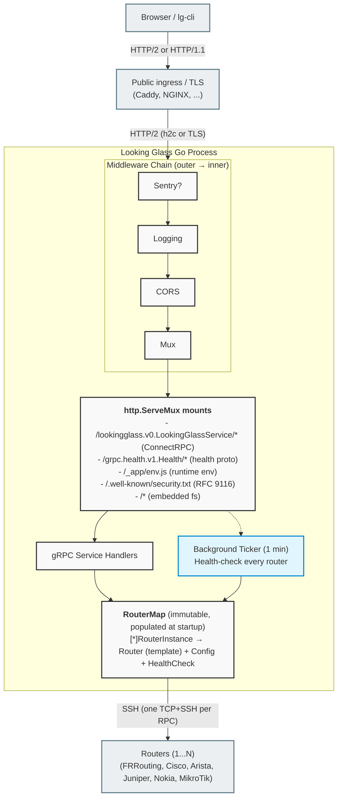

# Architecture

This page describes how Looking Glass is built — the pieces, how they talk to each other, and why certain decisions were made. It's aimed at anyone who wants to read the source with a map in hand, contribute non-trivial changes, or operate a deployment knowingly.

For a config-only view see [configuration.md](./configuration.md); for the API contract see [api.md](./api.md).

## Bird's-eye view



The server is a single Go binary. The WebUI is a SvelteKit static build embedded into the binary at compile time via `//go:embed`. Optional services (Redis, Sentry) are *external* to the process and toggled by config.

## Components

### `cmd/server` — entry point

`main.go` parses `config.yaml`, asks `pkg/routers` to materialise the device list, and hands control to `pkg/http.ListenAndServe`. The whole file is ~60 lines because the heavy lifting lives in `pkg/`.

The `//go:embed all:dist` directive is what gives the binary its self-contained nature. The SvelteKit build (`webui/`) writes its static output to `cmd/server/dist/` via the adapter-static configuration in `webui/svelte.config.js`, so the embed picks it up on the next `go build`.

### `cmd/cli` — `lg-cli`

Cobra-based CLI with one file per subcommand (`cmd_info.go`, `cmd_routers.go`, `cmd_pingtrace.go`, `cmd_bgp.go`, …). Shared plumbing lives in `root.go` (global flags, context with timeout + signal handling), `client.go` (ConnectRPC client construction), `index.go` (public-index lookup + ASN/name/URL resolution), and `output.go` (pretty / json / raw output modes).

See [cli.md](./cli.md) for the user-facing reference.

### `pkg/http` — listener + middleware

The HTTP/2 listener is constructed in `ListenAndServe`. The middleware chain is intentionally built bottom-up (innermost first) so the order of `handler = wrap(handler)` assignments matches the order each wrapper sees the request:

```go
handler = mux                                // base
handler = corsHandler.Handler(handler)       // CORS allow-list
handler = loggingHandler(handler)            // Structured slog + ETag
handler = sentryhttp.…Handle(handler)        // Sentry (optional)
```

So a request flows **outermost → innermost** as:

1. **Sentry** captures the request for tracing (optional).
2. **Logging** records start time + version-based ETag handling.
3. **CORS** adds the gRPC-Web allow-list.
4. **Mux** dispatches to gRPC / WebUI / security.txt / embedded fs.

The chain is defined in `pkg/http/http.go`. Unlike HTTP request logging and CORS, response caching is **not** managed at the HTTP middleware layer. Instead, it is evaluated at the gRPC service layer inside individual handlers in `pkg/http/grpc/service.go` using helper methods defined in `pkg/http/grpc/cache.go`. This allows for method-specific cache key namespaces (e.g. `ping:<router_id>:<target>`), caching only successful protobuf payloads, and automatic build-stable invalidation.

### `pkg/http/grpc` — ConnectRPC service

`Mux(ctx, mux, rts)` mounts the LookingGlassService handler and the gRPC-Health endpoint, then launches the health-check ticker. The service implementation is in `service.go`; it is a thin adapter:

* **Catalogue methods** (`GetInfo`, `GetRouters`) read from the in-memory router catalogue. No SSH, no I/O.
* **Operation methods** (`Ping`, `Traceroute`, `BGP*`) follow the same five-step recipe:
  1. Look up the router by ID. `errs.UnknownRouter` on miss.
  2. Parse/sanitise the operand (`utils.NewIPNetFromProtobuf` or `utils.SanitizeASPathRegex`). Sentinel on failure.
  3. Render the vendor template (`RouterInstance.Foo(operand)`).
  4. Execute commands over SSH (`utils.SSHExec`). Sentinel on failure (`errs.ExecFailed`).
  5. Wrap stdout into the protobuf response + server timestamp.

Errors visible to clients are intentionally coarse — see `pkg/errs`. Detailed context (hostname, stderr, etc.) is logged server-side with a tag like `op=Ping router_id=1 router=rt1 type=frrouting stage=ssh_exec: …`.

### `pkg/http/webui` — runtime env injector

The WebUI is built without any deployment-specific values baked in. On boot it fetches `/_app/env.js`, an ES module exporting a single `env` object. `webui.ConfigInjector` constructs this module from `utils.WebConfig` *at handler-creation time*, so the response body is precomputed and the hot path is a single memcpy.

This is a single source of truth: every `PUBLIC_*` key the WebUI reads is defined in `EnvJS` (`webui.go`) and consumed in `webui/src/lib/env.ts`. Adding a new key requires changes to both files.

### `pkg/routers` — template registry

The `Yaml` struct implements `utils.Router`. The whole point of the package is to load YAML templates (bundled and external) into a process-global registry.

* `init()` in `yaml.go` is where loading happens. The function panics on malformed input — see [Why panic at startup?](#why-panic-at-startup).
* `register(name, rt)` installs a template under a unique name. Duplicates panic; empty names panic.
* `Get(name)` is the runtime lookup, used by `CreateRouterMap`.
* `CreateRouterMap(cfg)` walks `cfg.Devices`, binds each to its template, and spawns one health-check goroutine per router.

The bundled templates live alongside the Go source as `*.yml` files and are embedded via `//go:embed all:*.yml`.

### `pkg/utils` — everything else

* `config.go` — YAML parsing + validation (`ValidateConfig`).
* `interface.go` — `Router` interface, `RouterInstance` (binds Router + Config + HealthCheck), `RouterMap` (slice + lookup).
* `ipnet.go` — IP / CIDR parsing + family detection. The `IPFamily` constants (`ipv4` / `ipv6`) are lower-case because they're interpolated verbatim into vendor commands.
* `sanitize.go` — `SanitizeASPathRegex`: tight allow-list for AS-path regex (digits and underscores only, ≤30 chars, optional `$` anchor). Prevents both command injection and ReDoS.
* `ssh.go` — `SSHExec(cfg, cmds)`: one TCP+SSH per call, runs each command in its own session, captures stdout, logs stderr on failure (truncated to 512 bytes), returns sentinel errors.
* `tls.go` — self-signed cert generation (`GenerateSelfSignedPair`) for `grpc.tls.self_signed: true`.
* `Version()` — lazily computed `<release>+<unix-nanos-hex>` used as the ETag, Sentry release, and `GetInfo` reply.

### `pkg/errs` — sentinel errors

Five files of one-liner `errors.New(...)`. The whole point is that RPC clients never see anything more specific than these sentinels; operators see the gory detail in logs. The split per file is purely organisational (ipnet / sanitize / router / ssh).

### `webui` — SvelteKit 5 frontend

A pnpm workspace linked to `../protobuf` via `workspace:*`. Key files:

* `svelte.config.js` — adapter-static, output to `../cmd/server/dist`.
* `src/lib/env.ts` — reads `PUBLIC_*` from `$env/dynamic/public` with sane defaults; consumed by every other module.
* `src/lib/grpc.ts` — singleton ConnectRPC client.
* `src/lib/stores/routers.ts` — fetches the router catalogue, refreshes every 5 minutes, pauses while the tab is hidden.
* `src/lib/stores/query.ts` — the actual RPC dispatch from the UI.
* `src/lib/components/CommandDock.svelte` — sticky-bottom command surface; the dock that's always reachable.
* `src/lib/components/ResultsSheet.svelte` — DevTools-style bottom sheet for command results.
* `hooks.client.ts` — lazy-imports `@sentry/svelte` when a DSN is configured.

### `protobuf` — buf-managed service contract

Single proto file (`lookingglass/v0/lookingglass.proto`) generates Go *and* TypeScript via `buf generate`. Comments in the `.proto` propagate into both languages, so the godoc / TSDoc are the single source of truth for API documentation. See [api.md](./api.md) for the full contract.

## Concurrency model

| Goroutine kind            | Lifetime              | Synchronisation                                                                       |
| ------------------------- | --------------------- | ------------------------------------------------------------------------------------- |
| HTTP request handlers     | One per request       | Stateless — each request is independent; no shared mutable state.                     |
| Health-check ticker       | One process-wide      | Reads/writes `HealthCheck` fields on each `RouterInstance` (single writer per router). |
| Async cache writes        | One per cache miss    | Fire-and-forget Redis SET; errors logged.                                              |
| Sentry flush on shutdown  | One                   | Internal to `sentry-go`.                                                              |

There is **no shared mutable state** between request handlers. `RouterMap` is populated once at startup and treated as immutable thereafter; `_routers` in `pkg/routers` likewise. This is the property that makes the server horizontally scalable: replicas share nothing except (optionally) the Redis cache.

The HealthCheck struct is technically read concurrently from RPC handlers and written concurrently from the ticker, but it holds only scalar values (`bool`, `time.Time`), so Go's memory model makes the race benign in practice — readers may see a slightly stale snapshot, never a torn struct.

## Request lifecycle (Ping example)

```
1.  Browser submits PingRequest{router_id:1, target:"1.1.1.1"}
    via ConnectRPC gRPC-Web.

2.  Caddy/NGINX terminates TLS; upstream sees h2c.

3.  Sentry middleware starts a transaction for the request.

4.  Logging middleware notes the start time; if
    If-None-Match=<version>, replies 304 and stops.

5.  CORS middleware adds Access-Control-Allow-* headers.

6.  Mux routes to LookingGlassServiceHandler.

7.  ConnectRPC decodes the proto, calls Ping(ctx, req).

8.  Ping():
    a. Generates the granular cache key `lg:rpc:<version>:ping:1:1.1.1.1`.
    b. Checks the shared Redis cache (`rpcCacheGet`):
       - **HIT**: Retrieves the cached `PingResponse`, sets the `X-Cache: HIT` response header, and returns immediately.
       - **MISS**: Continues execution:
         i.   rm.GetByID(1) → RouterInstance.
         ii.  utils.NewIPNetFromProtobuf("1.1.1.1") → IPNet{ipv4}.
         iii. RouterInstance.Ping(ipnet) renders "ping -n -4 -c5 -I 192.0.2.1 1.1.1.1" and runs it over SSH (`utils.SSHExec`).
         iv.  Assembles &PingResponse{result, timestamp}.
         v.   Spawns an asynchronous goroutine to save the marshaled protobuf response to Redis with the configured TTL (`rpcCacheSet`).

9.  ConnectRPC encodes the response.

10. Logging middleware writes a structured slog JSON record on the
    `httpaccess` component including duration and the X-Cache value.

13. Sentry middleware finishes the transaction (sampled per
    configuration).

14. Response returns to the browser.
```

## Startup sequence

1. `pkg/routers.init()` runs at import time:
   * Reads `$ROUTER_DIR` (if set), loads `*.yml` from there.
   * Reads embedded `*.yml`, loads any not already registered.
   * Any parse error → `log.Panicf` (process exits).
2. `cmd/server/main.go.main()`:
   * `fs.Sub(webemned, "dist")` strips the embed prefix.
   * Calls `Start(ctx, web)`.
3. `Start(ctx, web)`:
   * `utils.ParseConfigYaml("config.yaml")` → `*Config` (fatal on error).
   * `routers.CreateRouterMap(cfg)` → spawns one health-check goroutine per device.
   * `http.ListenAndServe(ctx, cfg, rm, web)` blocks for the lifetime of the listener.

There is currently **no graceful shutdown**. Cancelling `ctx` stops the health-check ticker but does not propagate to the HTTP server. This is a known limitation; for now, SIGTERM kills the process and any in-flight requests are lost. The stateless design makes this acceptable in practice.

## Why panic at startup?

Several code paths (`pkg/routers/yaml.go`, the duplicate-register case) panic instead of returning errors. This is deliberate:

* Malformed YAML, missing `name`, duplicate registrations all indicate **packaging defects**. The operator cannot fix them at runtime; the process should not pretend to start.
* Failing at startup is observable (process exits, the supervisor notices) while failing on every request is not (it surfaces as a 500 nobody investigates until a customer complains).
* The blast radius is bounded: the binary either runs cleanly or doesn't run at all.

## Why ConnectRPC?

Vanilla gRPC requires HTTP/2 trailers, which browsers do not expose to JavaScript. ConnectRPC implements three wire protocols on the same handler:

* `application/grpc`         — gRPC for native clients
* `application/grpc-web`     — gRPC-Web for browsers
* `application/json`         — Connect's own JSON-over-POST

The WebUI uses `@connectrpc/connect-web` (transport-aware), the Go CLI uses the regular gRPC transport, and you can debug with `curl` using JSON. One handler, three audiences.

A nice side effect: HTTP/1.1 clients can hit the JSON endpoint, so the `curl` sanity-check from [getting-started.md](./getting-started.md) works without any HTTP/2 plumbing on the client.

## Why embed the WebUI?

The trade-off is **build complexity for deployment simplicity**. Pros:

* One artefact to ship, version, sign, scan.
* Frontend and backend can never drift — same release, same git commit, same Sentry release tag.
* No web server / static-files CDN / object-store-with-public-acl to operate.

Cons:

* You can't independently rev the WebUI without rebuilding the Go binary (in practice this is fine; both are small).
* The Go binary is ~20MB rather than ~6MB.

The `webui/svelte.config.js` adapter-static writes directly to `cmd/server/dist`, so `go build` always picks up the freshest WebUI.

## SSH Connection Pooling

To mitigate SSH negotiation overhead and reduce the latency of repeated queries against the same device, Looking Glass implements transparent, self-healing, and concurrent-safe **SSH Connection Pooling**.

* **Configurable pool-size (`ssh_pool_size`)**: Pooling can be enabled on a per-device basis by setting `ssh_pool_size` to a value greater than `0`. Unset or non-positive values cleanly bypass pooling, defaulting to standard per-request unpooled dials.
* **Stateless & Fail-Fast**: To prevent thread starvation and queue build-up in clustered setups, the connection pool uses a stateless, thread-safe active counter and a LIFO idle slice. If all connection slots (`ssh_pool_size`) are utilized, the backend immediately fails-fast and returns a `ResourceExhausted` error to the client instead of blocking.
* **Keep-Alive & Self-Healing**: Idle connections are checked out using LIFO. Before checkout and on recycle, connections are validated using SSH keep-alive pings (`keepalive@openssh.com`). Dead or failed connections are automatically closed and discarded, and the pool slot is released.
* **Client Auto-Recovery**: To recover gracefully from backend pool exhaustion under concurrent load spikes, all clients (including the embedded SvelteKit Web UI and the `lg-cli` command-line tool) automatically recover from pool exhaustion errors using **exponential backoff retries** with jitter.

## File-level cross-reference

| Concern                                      | File                                       |
| -------------------------------------------- | ------------------------------------------ |
| Process entry, embed wiring                  | `cmd/server/main.go`                       |
| HTTP listener, middleware, TLS, h2c          | `pkg/http/http.go`                         |
| Redis cache helpers                          | `pkg/http/grpc/cache.go` (`rpcCacheGet`)   |
| Structured slog access log + ETag            | `pkg/http/http.go` (`loggingHandler`)      |
| Runtime env injector for the WebUI           | `pkg/http/webui/webui.go`                  |
| security.txt                                 | `pkg/http/http.go` (`SecurityTxtInjector`) |
| gRPC service handler                         | `pkg/http/grpc/service.go`                 |
| gRPC mount + health check ticker             | `pkg/http/grpc/grpc.go`                    |
| Template registry, loading rules             | `pkg/routers/routers.go`, `yaml.go`        |
| Bundled vendor templates                     | `pkg/routers/*.yml`                        |
| Config schema, parser, validator             | `pkg/utils/config.go`                      |
| Router interface, RouterInstance, RouterMap  | `pkg/utils/interface.go`                   |
| SSH client                                   | `pkg/utils/ssh.go`                         |
| IP / CIDR / family handling                  | `pkg/utils/ipnet.go`                       |
| AS-path sanitiser                            | `pkg/utils/sanitize.go`                    |
| TLS self-sign                                | `pkg/utils/tls.go`                         |
| Sentinel errors                              | `pkg/errs/*.go`                            |
| Protobuf contract (single source of truth)   | `protobuf/lookingglass/v0/lookingglass.proto` |
| WebUI runtime env consumer                   | `webui/src/lib/env.ts`                     |
| WebUI gRPC client                            | `webui/src/lib/grpc.ts`                    |
| WebUI router store + 5-min refresh           | `webui/src/lib/stores/routers.ts`          |
| WebUI command dispatch / results store       | `webui/src/lib/stores/query.ts`            |
