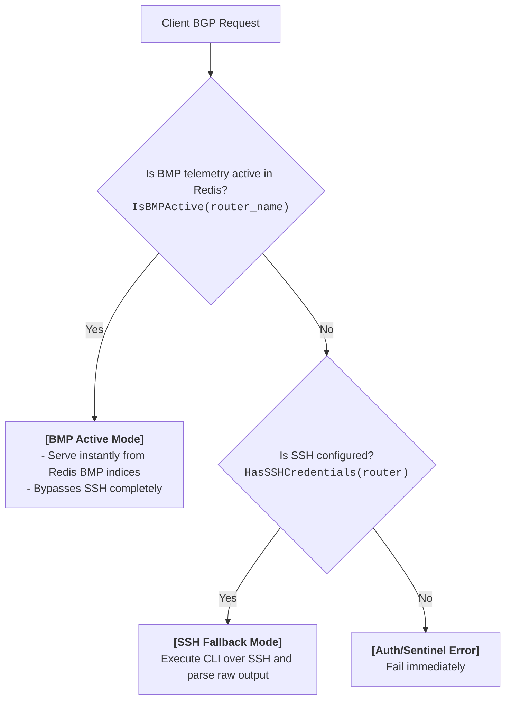

# BGP Monitoring Protocol (BMP) Support

Looking Glass integrates a high-performance, stateless, and vendor-agnostic BGP Monitoring Protocol (BMP, RFC 7854) collector. This document describes how BMP is implemented in Looking Glass, its benefits and drawbacks, how it interacts with standard SSH-based operations, configuration guidelines, and operational quirks to watch out for.

---

## 1. Overview of BMP in Looking Glass

The Looking Glass BMP collector runs a background TCP listener that receives real-time BGP telemetry directly from BMP-capable routers and route servers. Instead of running heavy command-line parsing over SSH on every user request, Looking Glass ingests standard BMP streams to build and maintain a real-time copy of the routing tables (RIB-In) and BGP peer session states.

This telemetry is stored entirely in **Redis**, structured across specific namespaces to optimize memory usage and support instantaneous query lookups:

*   **BGP Peers Index** (`lg:bmp:peers:<router>`): A Hash mapping Peer IP address to its session details, uptime, and received/accepted prefix counts.
*   **Routing Information Base (RIB)** (`lg:bmp:rib:<router>:<peer_ip>`): A Hash mapping BGP prefixes to their attributes (AS-Path, Next-Hop, Communities, Large Communities, and status flags).
*   **Secondary Lookup Indexes** (Redis Sets):
    *   **AS Path Index**: `lg:bmp:index:as:<router>:<asn>` contains members formatted as `<peer_ip>:<prefix>` for rapid AS-Path filtering.
    *   **Community Index**: `lg:bmp:index:community:<router>:<community>` maps Standard Communities to `<peer_ip>:<prefix>`.
    *   **Large Community Index**: `lg:bmp:index:large_community:<router>:<lc>` maps Large Communities to `<peer_ip>:<prefix>`.

---

## 2. Benefits of BMP

Implementing BMP in Looking Glass offers several advantages over traditional SSH command scraping:

*   **Extreme Performance (`< 1ms` Lookups)**: Since the routing table is cached in-memory inside Redis, BGP lookups bypass the router completely. Query latency drops from seconds (needed for SSH handshakes and CLI scraping) to sub-millisecond speeds.
*   **Zero CPU Load on Core Routers**: In high-traffic environments, hundreds of users querying a Looking Glass simultaneously can exhaust SSH connection pools or peg the CPU of a production router's control plane. BMP shifts all lookup computation and querying load away from the router to Looking Glass and Redis.
*   **SSH-Free (Credential-Free) Setup**: For high-scale public Internet Exchange Points (IXPs) or route servers, exposing SSH credentials to a looking glass application is a security risk. In BMP mode, Looking Glass can run without *any* SSH credentials or key access configured for the router, relying purely on the incoming BMP telemetry stream.
*   **Automatic Route Reconciliation (Self-Healing)**: Looking Glass automatically manages route synchronization. When a `PeerUp` message is received, Looking Glass flushes any pre-existing BGP peer routes and secondary index Sets in Redis before processing the fresh RIB-In dump. This prevents stale "ghost" routes from lingering in Redis when Looking Glass restarts or when the BMP collector session is interrupted.
*   **Instantaneous Session Teardown**: When a `PeerDown` message is processed, Looking Glass instantly purges all RIB and secondary index keys associated with that peer, ensuring that withdrawn routes disappear from the Looking Glass immediately.

---

## 3. Drawbacks and Limitations

While BMP is highly performant, it has distinct architectural trade-offs that operators must understand:

*   **BGP-Only Scope**: BMP only monitors BGP telemetry. It cannot execute active diagnostics like `ping` or `traceroute`. If a router is deployed in a BMP-only/SSH-free setup, trying to execute a ping or traceroute will return a clear error.
*   **Peer RIB-In Only (No RIB-Out / Advertised Routes)**: In accordance with standard BMP (RFC 7854), Looking Glass collects the **RIB-In** (routes received *from* BGP peers). It does **not** collect the **RIB-Out** (routes advertised *to* peers) or the router's local BGP table (Local-RIB). 
    *   *Operational Impact*: If users want to query "What routes am I advertising to this peer?" (e.g. `BGPPeerRoutes` in `advertised` mode), standard BMP cannot answer this. In contrast, standard SSH-based lookups can query RIB-Out dynamically by running vendor-specific CLI commands (e.g. `show ip bgp neighbors X advertised-routes`).
*   **Vendor-Dependent Attribute Coverage**: Some vendors may omit specific path attributes (such as transit communities, MEDs, or Local Preference) in their BMP Route Monitoring messages or format them in a proprietary manner.
*   **Hard Redis Dependency**: The BMP collector cannot operate without Redis. If Redis is unavailable, the TCP stream cannot write updates, and lookups will fail or fall back depending on configuration.

---

## 4. BMP and SSH Mutual Exclusivity

In Looking Glass, BGP queries for a single router are **mutually exclusive** between BMP and SSH modes.

### The Mutual Exclusivity Decision Flow

When a client requests a BGP query (`BGPSummary`, `BGPRoute`, `BGPPeerRoutes`, `BGPCommunity`, `BGPLargeCommunity`, or `BGPASPath`), the Looking Glass server determines how to serve the request:



### Operational Modes Explained

1.  **BMP Active Mode**: If Looking Glass detects active peer telemetry in Redis for a router (`IsBMPActive` is true), BGP queries are served **exclusively** from Redis. The server returns a success response with a banner `Result: Served from stateless BMP Redis store\n` and **never** makes an SSH connection.
2.  **SSH Fallback Mode (with SSH configured)**: If there is no active BMP peer telemetry in Redis (e.g., the BMP session is down, or has never connected), the server falls back to standard SSH execution. It connects to the router using configured credentials, runs the templated CLI commands, and parses the raw text.
3.  **BMP-Only Setup (No SSH credentials)**: If the router has no SSH credentials configured in `config.yaml` (`HasSSHCredentials` is false) and BMP telemetry is inactive, BGP queries **fail immediately** and gracefully with an authentication sentinel error (`errs.AuthFailed`), completely bypassing any SSH dial attempts or socket connections.

> ⚠️ **Warning on Hybrid/Fallback Setups**: If you configure both SSH credentials and BMP on a single router, an interruption in the BMP session will cause BGP queries to suddenly fall back to SSH template execution. Under heavy looking glass traffic, this can suddenly flood your router's control plane with SSH login requests and CLI parsing jobs. For production high-traffic deployments, **BMP-Only setups** (omitting SSH credentials) are strongly recommended to enforce absolute protection.

---

## 5. Configuration Reference & Operational Quirks

### Enabling BMP

To enable the BMP collector, configure the top-level `bmp` block in `config.yaml`:

```yaml
bmp:
  enabled: true
  listen: ":11019"             # TCP listen address for incoming feeds
```

*   **`enabled`**: Set to `true` to start the concurrent background TCP server and enable BMP lookups. Requires a configured `redis` cache block.
*   **`listen`**: The address and TCP port where Looking Glass listens for BMP client connections. BMP-capable routers must be configured to dial this IP/port as a BMP Collector.

### Device Matching (The Remote IP Quirk)

When a router dials the Looking Glass BMP TCP port, Looking Glass must associate the incoming telemetry with one of the devices defined in your `devices` list. 

*   **Matching Logic**: Looking Glass parses the TCP remote socket address of the incoming connection and compares the IP against the configured `hostname` or `ip` of all devices in the `devices` list. It automatically omits the port number from the configured `hostname` field (if present) before comparing or performing DNS resolution on the hostname.
*   **CRITICAL QUIRK**: If the router dials Looking Glass using an egress IP address that does **not** match the configured `hostname` or IP (e.g., dialing from a loopback interface or an out-of-band management IP that differs from the primary IP Looking Glass has configured), Looking Glass will fail to associate the incoming stream with your configured device. It will fallback to registering the telemetry under the raw remote host IP. As a result, BGP queries for your configured device ID will show empty results because the telemetry is stored under a different router name key.
*   *Mitigation*: Ensure that the router's BMP configuration specifies a source IP / source interface that matches the exact hostname/IP defined for that router in `config.yaml`.

### Longest Prefix Match (LPM) Probing

Looking Glass's BMP lookup engine implements a highly efficient Longest Prefix Match (LPM) algorithm:

1.  **Exact Match**: When searching for a target IP or CIDR (e.g., `192.0.2.1`), it checks for exact matches in the peer RIBs first.
2.  **HMGet Probing**: If no exact match is found, Looking Glass generates all possible enclosing subnets (all 33 possible masks for IPv4, or 129 masks for IPv6). It issues a **single atomic `HMGet` pipeline call** to Redis, querying all candidates at once.
3.  **LPM Ordering**: Looking Glass evaluates the returned results in order from the longest prefix mask down to the shortest, returning the most specific routing entry with zero loop overhead or high-latency multi-roundtrip checks.
